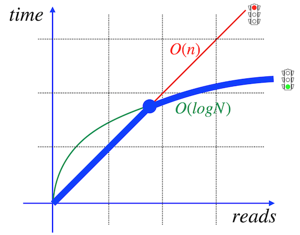

# Day 05 - Piscine SQL

## _Я улучшил свой SQL-запрос! Пожалуйста, предоставьте доказательства!_

Резюме: Сегодня вы узнаете, как и когда создавать индексы базы данных

## Preamble

Как индексация ускоряет работу? Почему один и тот же SQL-запрос с индексом и без него имеет различия в скорости выполнения (количество транзакций в секунду)? На самом деле, с точки зрения пользователя, индекс - это просто “черный ящик” с магией внутри. С “математической точки зрения” индекс - это просто организованная структура, в которой нет никакой магии. 

Позвольте мне объяснить причину, по которой индекс существует, но не используется. 

|  |  |
| ------ | ------ |
| Пожалуйста, взгляните на картинку, красная линия означает линейное время поиска данных на основе запроса. Другими словами, если вам нужно что-то найти, вы должны просмотреть каждый блок, страницу, кортеж и создать список строк для поиска. (у этого термина есть название “последовательное сканирование”). На самом деле, если вы создали индекс BTree, то вы получили повышение скорости. Итак, зеленая линия соответствует логарифмическому времени поиска. Давайте представим, что у вас есть 1000000 строк, и чтобы выполнить поиск по 1 строке, вам нужно, скажем... 1 секунда, то в общей сложности вам понадобится 1000000 секунд, но с индексом вам понадобится ln(1000000) ~ 14 секунд |  |
|  | Но почему... индекс не работает? Честно говоря, есть разные причины, но основная из них основана на общем количестве строк индексируемой таблицы. Пожалуйста, взгляните на картинку, я провел жирную синюю линию, и это путь для алгоритмов поиска. Как вы можете видеть, для алгоритмов лучше всего использовать линейное время в начале, а не логарифмический поиск. Как определить эту точку пересечения? В принципе, я могу порекомендовать эксперименты, тесты и ... вашу интуицию. Вообще никаких формул. Поэтому иногда, если вы хотите сравнить результаты вашего поиска, вам нужно явно отключить последовательное сканирование. Например, в PostgreSQL есть специальная команда, устанавливающая enable_seqscan =off |

## Rules of the day

- Наш способ получения знаний является постепенным и линейным, поэтому, пожалуйста, имейте в виду, что все изменения, которые вы внесли в День 03 во время упражнений 07-13, должны быть на месте (это похоже на то, что происходит в реальном мире, когда мы применяем релиз и должны быть согласованы с данными для новых изменений).

## Exercise 00 - Let’s create indexes for every foreign key

| Exercise 00: Let’s create indexes for every foreign key |                                                                                                                          |
|---------------------------------------|--------------------------------------------------------------------------------------------------------------------------|
| Turn-in directory                     | ex00                                                                                                                     |
| Files to turn-in                      | `day05_ex00.sql`                                                                                 |
| **Allowed**                               |                                                                                                                          |
| Language                        | ANSI SQL                                                                                              |

Пожалуйста, создайте простой индекс BTree для каждого внешнего ключа в нашей базе данных. Шаблон имени должен удовлетворять следующему правилу “idx_{имя_таблицы}_{имя_столбца}”. Например, имя индекса BTree для столбца pizzeria_id в таблице `menu` равно `idx_menu_pizzeria_id`.

## Chapter V
## Exercise 01 - How to see that index works?

| Exercise 01: How to see that index works?|                                                                                                                          |
|---------------------------------------|--------------------------------------------------------------------------------------------------------------------------|
| Turn-in directory                     | ex01                                                                                                                     |
| Files to turn-in                      | `day05_ex01.sql`                                                                                 |
| **Allowed**                               |                                                                                                                          |
| Language                        | ANSI SQL                                                                                              |

Прежде чем приступить к дальнейшим действиям, пожалуйста, напишите инструкцию SQL, которая возвращает названия пицц и соответствующих пиццерий. Пожалуйста, взгляните на пример результата ниже (сортировка не требуется).

| pizza_name | pizzeria_name | 
| ------ | ------ |
| cheese pizza | Pizza Hut |
| ... | ... |

Давайте представим доказательства того, что ваши индексы работают для вашего SQL.  
Примером доказательства является вывод команды `EXPLAIN ANALYZE`.  
Пожалуйста, ознакомьтесь с примером команды вывода.
    
    ...
    ->  Index Scan using idx_menu_pizzeria_id on menu m  (...)
    ...

**Подсказка**: пожалуйста, подумайте, почему ваши индексы не работают напрямую и что мы должны сделать, чтобы это включить?

## Exercise 02 - Formula is in the index. Is it Ok?

| Exercise 02: Formula is in the index. Is it Ok?|                                                                                                                          |
|---------------------------------------|--------------------------------------------------------------------------------------------------------------------------|
| Turn-in directory                     | ex02                                                                                                                     |
| Files to turn-in                      | `day05_ex02.sql`                                                                                 |
| **Allowed**                               |                                                                                                                          |
| Language                        | ANSI SQL                                                                                              |

Пожалуйста, создайте функциональный индекс в виде B-дерева с именем `idx_person_name` для имени столбца таблицы `person`. Индекс должен содержать имена пользователей в верхнем регистре. 

Пожалуйста, напишите и предоставьте любой SQL-код с доказательством (`EXPLAIN ANALYZE`) того, что индекс idx_person_name работает.

## Exercise 03 - Multicolumn index for our goals

| Exercise 03: Multicolumn index for our goals |                                                                                                                          |
|---------------------------------------|--------------------------------------------------------------------------------------------------------------------------|
| Turn-in directory                     | ex03                                                                                                                     |
| Files to turn-in                      | `day05_ex03.sql`                                                                                 |
| **Allowed**                               |                                                                                                                          |
| Language                        | ANSI SQL                                                                                              |

Пожалуйста, создайте лучший многоколоночный индекс B-дерева с именем `idx_person_order_multi` для приведенной ниже инструкции SQL.

    SELECT person_id, menu_id,order_date
    FROM person_order
    WHERE person_id = 8 AND menu_id = 19;

Команда `EXPLAIN ANALYZE` должна вернуть следующий шаблон. Пожалуйста, обратите внимание на проверку `Index Only Scan`!

    Index Only Scan using idx_person_order_multi on person_order ...

Пожалуйста, предоставьте любой SQL-код с доказательством (`EXPLAIN ANALYZE`) того, что индекс `idx_person_order_multi` работает. 

## Exercise 04 - Uniqueness for data

| Exercise 04: Uniqueness for data |                                                                                                                          |
|---------------------------------------|--------------------------------------------------------------------------------------------------------------------------|
| Turn-in directory                     | ex04                                                                                                                     |
| Files to turn-in                      | `day05_ex04.sql`                                                                                 |
| **Allowed**                               |                                                                                                                          |
| Language                        | ANSI SQL                                                                                              |

Пожалуйста, создайте уникальный индекс BTree с именем `idx_menu_unique` в таблице `меню` для столбцов `pizzeria_id` и `pizza_name`. 
Пожалуйста, напишите и предоставьте любой SQL-код с доказательством ("ОБЪЯСНИТЕ, ПРОАНАЛИЗИРУЙТЕ"`EXPLAIN ANALYZE`) того, что индекс `idx_menu_unique` работает.

## Exercise 05 - Partial uniqueness for data

| Exercise 05: Partial uniqueness for data |                                                                                                                          |
|---------------------------------------|--------------------------------------------------------------------------------------------------------------------------|
| Turn-in directory                     | ex05                                                                                                                     |
| Files to turn-in                      | `day05_ex05.sql`                                                                                 |
| **Allowed**                               |                                                                                                                          |
| Language                        | ANSI SQL                                                                                              |

Пожалуйста, создайте частично уникальный индекс BTree с именем `idx_person_order_order_date` в таблице `person_order` для атрибутов `person_id` и `menu_id` с частичной уникальностью для столбца `order_date` для даты ‘2022-01-01’.

Команда `EXPLAIN ANALYZE` должна вернуть следующий шаблон

    Index Only Scan using idx_person_order_order_date on person_order …

## Exercise 06 - Let’s make performance improvement

| Exercise 06: Let’s make performance improvement|                                                                                                                          |
|---------------------------------------|--------------------------------------------------------------------------------------------------------------------------|
| Turn-in directory                     | ex06                                                                                                                     |
| Files to turn-in                      | `day05_ex06.sql`                                                                                 |
| **Allowed**                               |                                                                                                                          |
| Language                        | ANSI SQL                                                                                              |

Пожалуйста, взгляните на SQL ниже с технической точки зрения (игнорируйте логический пример этого SQL-оператора).

    SELECT
        m.pizza_name AS pizza_name,
        max(rating) OVER (PARTITION BY rating ORDER BY rating ROWS BETWEEN UNBOUNDED PRECEDING AND UNBOUNDED FOLLOWING) AS k
    FROM  menu m
    INNER JOIN pizzeria pz ON m.pizzeria_id = pz.id
    ORDER BY 1,2;

Создайте новый индекс BTree с именем `idx_1`, который должен улучшить показатель "Время выполнения" этого SQL. Пожалуйста, предоставьте доказательства (`EXPLAIN ANALYZE`) того, что SQL был улучшен.

**Подсказка**: это упражнение похоже на задачу “грубой силы”, чтобы найти хороший индекс покрытия, поэтому перед вашим новым тестом удалите индекс `idx_1`.

Пример моего улучшения:

**Before**:

    Sort  (cost=26.08..26.13 rows=19 width=53) (actual time=0.247..0.254 rows=19 loops=1)
    "  Sort Key: m.pizza_name, (max(pz.rating) OVER (?))"
    Sort Method: quicksort  Memory: 26kB
    ->  WindowAgg  (cost=25.30..25.68 rows=19 width=53) (actual time=0.110..0.182 rows=19 loops=1)
            ->  Sort  (cost=25.30..25.35 rows=19 width=21) (actual time=0.088..0.096 rows=19 loops=1)
                Sort Key: pz.rating
                Sort Method: quicksort  Memory: 26kB
                ->  Merge Join  (cost=0.27..24.90 rows=19 width=21) (actual time=0.026..0.060 rows=19 loops=1)
                        Merge Cond: (m.pizzeria_id = pz.id)
                        ->  Index Only Scan using idx_menu_unique on menu m  (cost=0.14..12.42 rows=19 width=22) (actual time=0.013..0.029 rows=19 loops=1)
                            Heap Fetches: 19
                        ->  Index Scan using pizzeria_pkey on pizzeria pz  (cost=0.13..12.22 rows=6 width=15) (actual time=0.005..0.008 rows=6 loops=1)
    Planning Time: 0.711 ms
    Execution Time: 0.338 ms

**After**:

    Sort  (cost=26.28..26.33 rows=19 width=53) (actual time=0.144..0.148 rows=19 loops=1)
    "  Sort Key: m.pizza_name, (max(pz.rating) OVER (?))"
    Sort Method: quicksort  Memory: 26kB
    ->  WindowAgg  (cost=0.27..25.88 rows=19 width=53) (actual time=0.049..0.107 rows=19 loops=1)
            ->  Nested Loop  (cost=0.27..25.54 rows=19 width=21) (actual time=0.022..0.058 rows=19 loops=1)
                ->  Index Scan using idx_1 on …
                ->  Index Only Scan using idx_menu_unique on menu m  (cost=0.14..2.19 rows=3 width=22) (actual time=0.004..0.005 rows=3 loops=6)
    …
    Planning Time: 0.338 ms
    Execution Time: 0.203 ms

[Вернуться в README.md](../README.md)