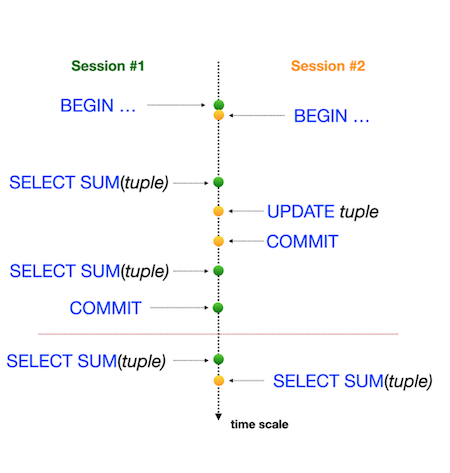

# Day 08 - Piscine SQL

## _Изоляция - одно из свойств ACID_

Резюме: Сегодня вы увидите, как база данных работает с транзакциями и уровнями изоляции.

## Rules of the day

- Наш способ получения знаний является постепенным и линейным, поэтому, пожалуйста, имейте в виду, что все изменения, которые вы внесли в День 03 во время упражнений 07-13, должны быть на месте (это похоже на то, что происходит в реальном мире, когда мы применяем релиз и должны быть согласованы с данными для новых изменений).

## Exercise 00 - Simple transaction

| Exercise 00: Simple transaction |                                                                                                                          |
|---------------------------------------|--------------------------------------------------------------------------------------------------------------------------|
| Turn-in directory                     | ex00                                                                                                                     |
| Files to turn-in                      | `day08_ex00.sql` with comments for Session #1, Session #2 statements; screenshot of psql output for Session #1; screenshot of psql output for Session #2 |
| **Allowed**                               |                                                                                                                          |
| Language                        |  SQL|

Пожалуйста, используйте для этой задачи командную строку для базы данных PostgreSQL (psql). Вам нужно проверить, как ваши изменения будут опубликованы в базе данных для других пользователей базы данных. 

На самом деле, нам нужны две активные сессии (т.е. 2 параллельные сессии в командной строке). 

Пожалуйста, предоставьте подтверждение того, что ваш параллельный сеанс не сможет увидеть ваши изменения, пока вы не сделаете `COMMIT`(ФИКСАЦИЮ);

Смотрите шаги ниже.

**Session #1**
- Обновлен рейтинг "Pizza Hut" до 5 баллов в режиме транзакции.
- Убедитесь, что вы можете увидеть изменения в сеансе №1.

**Session #2**
- Убедитесь, что вы не видите изменений в сеансе №2.

**Session #1**
- Публикуйте свои изменения для всех параллельных сеансов

**Session #2**
- Убедитесь, что вы видите изменения в сеансе №2.

Итак, взгляните на пример нашего вывода для сессии №2.

    pizza_db=> select * from pizzeria where name  = 'Pizza Hut';
    id |   name    | rating
    ----+-----------+--------
    1 | Pizza Hut |    4.6
    (1 row)

    pizza_db=> select * from pizzeria where name  = 'Pizza Hut';
    id |   name    | rating
    ----+-----------+--------
    1 | Pizza Hut |      5
    (1 row)

Вы можете видеть, что один и тот же запрос возвращает разные результаты, поскольку первый запрос был выполнен перед публикацией в сеансе №1, а второй запрос был выполнен после завершения сеанса №1.

## Exercise 01 - Lost Update Anomaly

| Exercise 01: Lost Update Anomaly|                                                                                                                          |
|---------------------------------------|--------------------------------------------------------------------------------------------------------------------------|
| Turn-in directory                     | ex01                                                                                                                     |
| Files to turn-in                      | `day08_ex01.sql` with comments for Session #1, Session #2 statements; screenshot of psql output for Session #1; screenshot of psql output for Session #2                                                                                 |
| **Allowed**                               |                                                                                                                          |
| Language                        |  SQL                                                                                              |

Пожалуйста, используйте для этой задачи командную строку для базы данных PostgreSQL (psql). Вам нужно проверить, как ваши изменения будут опубликованы в базе данных для других пользователей базы данных. 

На самом деле, нам нужны две активные сессии (т.е. 2 параллельные сессии в командной строке). 

Перед запуском задачи убедитесь, что в вашей базе данных установлен стандартный уровень изоляции. Просто выполните следующую инструкцию `SHOW TRANSACTION ISOLATION LEVEL;`, и результатом должно быть "read committed".

Если нет, пожалуйста, установите уровень изоляции read committed явно на уровне сеанса.

|  |  |
| ------ | ------ |
| Давайте рассмотрим один из известных шаблонов базы данных "Lost Update Anomaly"(Аномалия потерянного обновления). Вы можете увидеть графическое представление этой аномалии на рисунке. Горизонтальная красная линия представляет окончательные результаты после выполнения всех последовательных шагов в обоих сеансах. |  |

Пожалуйста, проверьте рейтинг "Pizza Hut" в режиме транзакции для обеих сессий, а затем  `UPDATE` рейтинг до значения 4 в сессии №1 и  `UPDATE` рейтинг до значения 3,6 в сессии №2 (в том же порядке, что и в на картинке).

## Exercise 02 - Lost Update for Repeatable Read

| Exercise 02: Lost Update for Repeatable Read|                                                                                                                          |
|---------------------------------------|--------------------------------------------------------------------------------------------------------------------------|
| Turn-in directory                     | ex02                                                                                                                     |
| Files to turn-in                      | `day08_ex02.sql` with comments for Session #1, Session #2 statements; screenshot of psql output for Session #1; screenshot of psql output for Session #2                                                                                  |
| **Allowed**                               |                                                                                                                          |
| Language                        |  SQL                                                                                              |

Пожалуйста, используйте для этой задачи командную строку для базы данных PostgreSQL (psql). Вам нужно проверить, как ваши изменения будут опубликованы в базе данных для других пользователей базы данных. 

На самом деле, нам нужны две активные сессии (т.е. 2 параллельные сессии в командной строке).

|  |  |
| ------ | ------ |
| Давайте рассмотрим один из известных шаблонов базы данных "Lost Update Anomaly", но с уровнем изоляции `REPEATABLE READ`. Вы можете увидеть графическое представление этой аномалии на рисунке. Горизонтальная красная линия означает окончательные результаты после выполнения всех последовательных шагов для обоих сеансов.|  |

Пожалуйста, проверьте рейтинг "Pizza Hut" в режиме транзакции для обеих сессий, а затем `UPDATE` рейтинг до значения 4 в сессии №1 и `UPDATE` рейтинг до значения 3,6 в сессии №2 (в том же порядке, что и в на картинке).

## Exercise 03 - Non-Repeatable Reads Anomaly

| Exercise 03: Non-Repeatable Reads Anomaly |                                                                                                                          |
|---------------------------------------|--------------------------------------------------------------------------------------------------------------------------|
| Turn-in directory                     | ex03                                                                                                                     |
| Files to turn-in                      | `day08_ex03.sql` with comments for Session #1, Session #2 statements; screenshot of psql output for Session #1; screenshot of psql output for Session #2                                                                                 |
| **Allowed**                               |                                                                                                                          |
| Language                        |  SQL                                                                                              |

Пожалуйста, используйте для этой задачи командную строку для базы данных PostgreSQL (psql). Вам нужно проверить, как ваши изменения будут опубликованы в базе данных для других пользователей базы данных. 

На самом деле, нам нужны две активные сессии (т.е. 2 параллельные сессии в командной строке).

|  |  |
| ------ | ------ |
| Давайте проверим один из известных шаблонов базы данных "Non-Repeatable Reads"(Неповторяемое чтение), но с уровнем изоляции `READ COMMITTED`. Вы можете увидеть графическое представление этой аномалии на рисунке. Горизонтальная красная линия представляет конечный результат после выполнения всех последовательных шагов для обоих сеансов. |  |

Пожалуйста, проверьте рейтинг "Pizza Hut" в режиме транзакции для сеанса №1, а затем `UPDATE` рейтинг до значения 3,6 в сеансе №2 (в том же порядке, что и на картинке).

## Exercise 04 - Non-Repeatable Reads for Serialization

| Exercise 04: Non-Repeatable Reads for Serialization |                                                                                                                          |
|---------------------------------------|--------------------------------------------------------------------------------------------------------------------------|
| Turn-in directory                     | ex04                                                                                                                     |
| Files to turn-in                      | `day08_ex04.sql` с комментариями к заявлениям сессии #1, сессии #2; скриншот вывода psql для сессии #1; скриншот вывода psql для сессии #2                                                                                 |
| **Allowed**                               |                                                                                                                          |
| Language                        |  SQL                                                                                              |

Пожалуйста, используйте для этой задачи командную строку для базы данных PostgreSQL (psql). Вам нужно проверить, как ваши изменения будут опубликованы в базе данных для других пользователей базы данных. 

На самом деле, нам нужны две активные сессии (т.е. 2 параллельные сессии в командной строке).

|  |  |
| ------ | ------ |
| Давайте проверим один из известных шаблонов базы данных "Non-Repeatable Reads"(Неповторяемое чтение), но с уровнем изоляции `SERIALIZABLE`. Вы можете увидеть графическое представление этой аномалии на рисунке. Горизонтальная красная линия представляет окончательные результаты после выполнения всех последовательных шагов для обоих сеансов. |  |

Пожалуйста, проверьте рейтинг "Pizza Hut" в режиме транзакции для сеанса №1, а затем `UPDATE` рейтинг до значения 3,0 в сеансе №2 (в том же порядке, что и на картинке).

## Exercise 05 - Phantom Reads Anomaly

| Exercise 05: Phantom Reads Anomaly|                                                                                                                          |
|---------------------------------------|--------------------------------------------------------------------------------------------------------------------------|
| Turn-in directory                     | ex05                                                                                                                     |
| Files to turn-in                      | `day08_ex05.sql`  с комментариями к заявлениям сессии #1, сессии #2; скриншот вывода psql для сессии #1; скриншот вывода psql для сессии #2                                                                                 |
| **Allowed**                               |                                                                                                                          |
| Language                        |   SQL                                                                                              |

Пожалуйста, используйте для этой задачи командную строку для базы данных PostgreSQL (psql). Вам нужно проверить, как ваши изменения будут опубликованы в базе данных для других пользователей базы данных. 

На самом деле, нам нужны две активные сессии (т.е. 2 параллельные сессии в командной строке).

|  |  |
| ------ | ------ |
| Давайте проверим один из известных шаблонов "phantom reads" (фантомного чтения) базы данных, но с уровнем изоляции `READ COMMITTED`. Вы можете увидеть графическое представление этой аномалии на рисунке. Горизонтальная красная линия представляет окончательные результаты после выполнения всех последовательных шагов для обоих сеансов. |  |

Пожалуйста, суммируйте все оценки для всех пиццерий в режиме одной транзакции для сеанса №1, а затем `UPDATE` рейтинг до значения 1 для ресторана "Pizza Hut" в сеансе №2 (в том же порядке, что и на картинке).

## Exercise 06 - Phantom Reads for Repeatable Read

| Exercise 06: Phantom Reads for Repeatable Read|                                                                                                                          |
|---------------------------------------|--------------------------------------------------------------------------------------------------------------------------|
| Turn-in directory                     | ex06                                                                                                                     |
| Files to turn-in                      | `day08_ex06.sql` с комментариями к заявлениям сессии #1, сессии #2; скриншот вывода psql для сессии #1; скриншот вывода psql для сессии #2                                                                                 |
| **Allowed**                               |                                                                                                                          |
| Language                        |  SQL                                                                                              |

Пожалуйста, используйте для этой задачи командную строку для базы данных PostgreSQL (psql). Вам нужно проверить, как ваши изменения будут опубликованы в базе данных для других пользователей базы данных. 

На самом деле, нам нужны две активные сессии (т.е. 2 параллельные сессии в командной строке).

|  |  |
| ------ | ------ |
| Давайте проверим один из известных шаблонов базы данных "Phantom Reads" (Фантомное считывание), но с уровнем изоляции `REPEATABLE READ`. Вы можете увидеть графическое представление этой аномалии на рисунке. Горизонтальная красная линия представляет окончательные результаты после выполнения всех последовательных шагов для обоих сеансов. |  |

Пожалуйста, суммируйте все оценки для всех пиццерий в режиме одной транзакции для сеанса №1, а затем `UPDATE` рейтинг до 5 для ресторана "Pizza Hut" в сеансе №2 (в том же порядке, что и на картинке).

## Exercise 07 - Deadlock

| Exercise 07: Deadlock|                                                                                                                          |
|---------------------------------------|--------------------------------------------------------------------------------------------------------------------------|
| Turn-in directory                     | ex07                                                                                                                     |
| Files to turn-in                      | `day08_ex07.sql` с комментариями к заявлениям сессии #1, сессии #2; скриншот вывода psql для сессии #1; скриншот вывода psql для сессии #2                                                                                |
| **Allowed**                               |                                                                                                                          |
| Language                        |  SQL                                                                                              |

Пожалуйста, используйте для этой задачи командную строку для базы данных PostgreSQL (psql). Вам нужно проверить, как ваши изменения будут опубликованы в базе данных для других пользователей базы данных. 

На самом деле, нам нужны две активные сессии (т.е. 2 параллельные сессии в командной строке).

Давайте воспроизведем тупиковую ситуацию в нашей базе данных.

|  |  |
| ------ | ------ |
| Вы можете увидеть графическое представление ситуации взаимоблокировки на рисунке. Это похоже на "перекрестный замок" между параллельными сессиями. |  |

Пожалуйста, напишите любую инструкцию SQL с любым уровнем изоляции (вы можете использовать настройку по умолчанию) в таблице `pizzeria`, чтобы воспроизвести эту тупиковую ситуацию.

[Вернуться в README.md](../README.md)